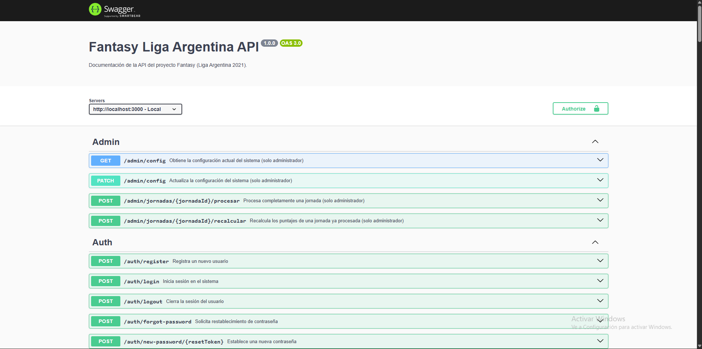
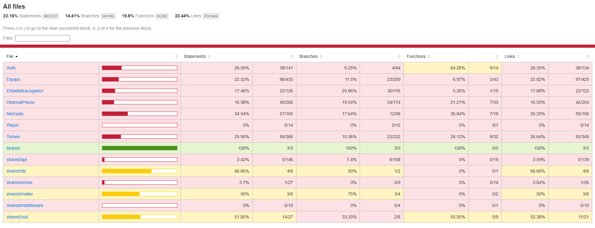

# Documentación: BackEnd Fantasy

Este directorio contiene toda la documentación técnica, manuales de integración y evidencia de calidad generada para la API REST del proyecto. Cumpliendo con los requisios de la materia, esta documentación abarca tres áreas fundamentales:

---

## 1. Documentación de la API REST (Swagger)

La documentación para los consumidores de la API (como el equipo de Frontend) ha sido generada utilizando **Swagger UI** (`swagger-jsdoc`). En ella se detallan todos los endpoints disponibles, métodos HTTP, parámetros requeridos, esquemas de validación y modelos de respuesta.

**Para explorar la API interactivamente:**
1. Ejecute el servidor localmente (`pnpm start:dev`).
2. Ingrese desde su navegador a: `http://localhost:3000/api-docs`

**Vista Previa:**

---

## 2. Estructura del Código Fuente (TypeDoc)

La lógica de negocio interna, los servicios, controladores, esquemas de Zod y entidades de MikroORM han sido documentados utilizando el estándar de comentarios **TSDoc**. 

A partir de estos comentarios, se generó un sitio web estático navegable utilizando TypeDoc, el cual permite explorar la jerarquía de clases y las firmas de los métodos.

**[Explorar la Documentación del Código](./index.html)** *(Nota: Para poder navegar por este sitio, es necesario haber descargado el repositorio y abrir el archivo `index.html` de esta misma carpeta en un navegador web).*

---

## 3. Evidencia de Pruebas Automatizadas (Testing)

El proyecto cuenta con un sitio de tests automatizados desarrollada con **Jest**. Se implementaron:
* **Tests Unitarios:** Para validar los esquemas de Zod, la lógica de autenticación y los cálculos matemáticos aislados.
* **Tests de Integración:** Para validar el flujo completo de los torneos, el sistema de Draft de jugadores, y el mercado de transferencias simulando peticiones HTTP reales sobre una base de datos aislada configurada para pruebas.

**Cobertura de Código (Coverage) y Resultados:**
Al ejecutar el comando `pnpm run test:coverage`, el sitio de pruebas imprimirá el siguiente informe de cobertura, destacando un 100% de eficacia en la validación de esquemas de autenticación y entidades compartidas:

